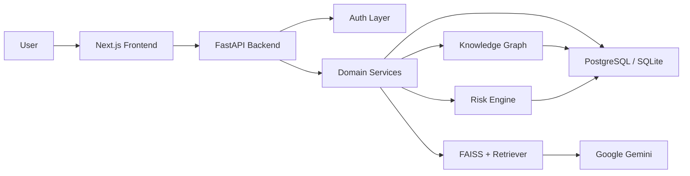
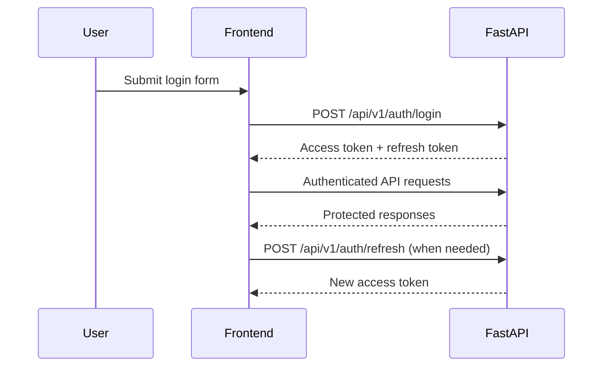

# Sentinel AI

<div align="center">
  <h3>Industrial safety intelligence platform for plant monitoring, compound risk analysis, explainable reasoning, and grounded AI copiloting.</h3>
  <p>
    
    
    
    
    
    
    
    
  </p>
  <p>
    <a href="#overview">Overview</a> |
    <a href="#features">Features</a> |
    <a href="#architecture">Architecture</a> |
    <a href="#installation">Installation</a> |
    <a href="#live-demo">Live Demo</a> |
    <a href="#contact">Contact</a>
  </p>
</div>

> This README is based on the repository source code and committed project structure. Where deployment or assets are not explicitly versioned in the repository, that is stated directly instead of guessed.

## Overview

Sentinel AI is a full-stack industrial safety platform that combines operations monitoring, contextual risk intelligence, and grounded AI assistance in one system.

From the repository, the project includes:

- A Next.js frontend with protected routes, dashboards, analytics, plant monitoring, incident workflows, permits, maintenance, notifications, compliance, and an AI copilot workspace
- A FastAPI backend exposing 82 REST endpoints under `/api/v1`
- A rich industrial domain model covering plants, zones, equipment, sensors, workers, permits, incidents, maintenance, compliance, documents, and chat history
- An AI stack that combines risk scoring, explainability, historical similarity, knowledge graph analysis, FAISS retrieval, SentenceTransformers embeddings, and Gemini-based response generation

## Problem Statement

Industrial safety decisions depend on more than a single alert or sensor value. Teams need to understand plant topology, equipment status, worker presence, permits, maintenance, incidents, and historical context at the same time.

Sentinel AI addresses this fragmentation by bringing operational monitoring, decision support, and grounded AI guidance into one platform.

## Solution

Sentinel AI combines:

- A role-aware operations interface for safety and plant teams
- A FastAPI backend for consistent domain APIs and workflows
- A compound risk engine with explainable results and recommendations
- A knowledge graph for relationship-aware operational reasoning
- A retrieval-augmented AI copilot grounded in indexed documents, live context, and applicable references

The result is a system that helps teams monitor plant conditions, understand emerging risks, and respond with evidence-backed guidance.

## Live Demo

Frontend: <`https://sentinel-ai-jrxg.vercel.app/login`>

Backend API: `https://api.sentinelai.sbs`

API Docs: `https://api.sentinelai.sbs/docs`

## Demo Credentials

Admin Login

Email: `admin@sentinelai.com`

Password: `Admin123!`

> These credentials are provided for evaluation purposes only.

## Features

### Core Platform

- Protected frontend with login and session management
- Role-aware navigation for `admin`, `plant_manager`, `safety_officer`, `maintenance`, and `viewer`
- Standardized FastAPI `APIResponse<T>` contracts
- OpenAPI documentation available through `/docs`, `/redoc`, and `/openapi.json`

### Operations and Monitoring

- Dashboard summaries for live risks, alerts, incidents, and recommendations
- Plant, zone, equipment, sensor, and worker management workflows
- Permit-to-work, maintenance, notification, and compliance modules
- Incident tracking with AI-oriented incident reporting support
- Simulation endpoints for scenario-based safety analysis

### Intelligence Layer

- Compound risk scoring with severity, confidence, evidence, and actions
- Rule-driven risk evaluation from `backend/app/risk_engine/rules.json`
- Historical similarity across prior incidents and process datasets
- Knowledge graph exploration, neighbor tracing, and impact analysis
- FAISS-backed document retrieval with SentenceTransformers embeddings
- Gemini-powered copilot with citations, retrieved context, and offline fallback behavior

## Tech Stack

| Category | Technologies |
|---|---|
| Frontend | Next.js 15, React 19, TypeScript, Tailwind CSS, React Query, Axios, Framer Motion, Recharts, Leaflet |
| Backend | FastAPI, Uvicorn, SQLAlchemy 2, Alembic, Pydantic Settings |
| Database | PostgreSQL via `asyncpg`, SQLite fallback via `aiosqlite` |
| AI / ML | SentenceTransformers, FAISS, NumPy, NetworkX, Google Gemini |
| Authentication | JWT access and refresh tokens, bcrypt password hashing, HTTP bearer auth |
| APIs | REST endpoints under `/api/v1`, OpenAPI docs, Gemini HTTP integration via `httpx` |

## Architecture



Sentinel AI follows a split frontend/backend architecture where the FastAPI backend handles authentication, operational workflows, risk analysis, retrieval, and AI orchestration.

## Authentication Flow



- Frontend requests include bearer token injection through the API client
- Refresh flow is handled automatically when an access token expires
- Failed refresh attempts trigger frontend session cleanup

## API Modules

The backend exposes 82 endpoints grouped into major modules:

- Authentication
- Dashboard
- AI Copilot
- Risk Analysis
- Analytics
- Equipment
- Sensors
- Workers
- Notifications
- Compliance
- Plants
- Zones
- Permits
- Maintenance
- Incidents
- Knowledge Graph
- Simulation

## Project Structure

```text
Sentinel AI/
|-- backend/
|   |-- alembic/
|   |-- app/
|   |   |-- ai/
|   |   |-- api/
|   |   |-- core/
|   |   |-- database/
|   |   |-- knowledge_graph/
|   |   |-- models/
|   |   |-- rag/
|   |   |-- risk_engine/
|   |   |-- services/
|   |   `-- vector_store/
|   `-- requirements.txt
|-- datasets/
|-- frontend/
|   |-- public/
|   `-- src/
|-- scripts/
|-- README.md
`-- LICENSE
```

## Installation

### Prerequisites

- Python 3.11+
- Node.js 18+
- PostgreSQL if not using SQLite fallback

### 1. Clone the Repository

```bash
git clone <YOUR_REPOSITORY_URL>
cd "Sentinal ai"
```

### 2. Backend Setup

```bash
cd backend
python -m venv .venv
.venv\Scripts\activate
pip install -r requirements.txt
```

### 3. Frontend Setup

```bash
cd frontend
npm install
```

### 4. Configure Environment Variables

Set the required backend and frontend environment variables before starting the app.

### 5. Run the Application

Backend:

```bash
cd backend
uvicorn app.main:app --reload
```

Frontend:

```bash
cd frontend
npm run dev
```

### Optional Dataset Loading

The `scripts/` folder includes loaders for project datasets such as AI4I, OSHA, and Tennessee Eastman style data.

## Environment Variables

The most important variables to configure are:

| Variable | Purpose |
|---|---|
| `DATABASE_URL` | Primary database connection string |
| `JWT_SECRET` | Secret used to sign access and refresh tokens |
| `GEMINI_API_KEY` | Google Gemini API key for copilot generation |
| `NEXT_PUBLIC_API_BASE_URL` | Frontend base URL for backend API calls |

## Deployment

The repository clearly shows a split deployment model:

- Frontend deployed separately from the backend
- Backend served as a standalone FastAPI application
- Database support for PostgreSQL with SQLite fallback
- Gemini consumed as an external API service

The repository does not include committed Docker, Compose, Render, Vercel, reverse proxy, or CI/CD configuration files, so exact production deployment steps cannot be stated with certainty from source alone.

## Screenshots

No product UI screenshots are committed in the analyzed repository snapshot.

Available visual asset:

- `frontend/public/logo.png`

Recommended submission captures:

- Dashboard overview
- Risk Center
- AI Copilot

## Contact

- GitHub: [@Shubhankar0126](https://github.com/Shubhankar0126)
- LinkedIn: `https://www.linkedin.com/in/shubhankar-pandey-ai/`
- Email: `Shubhankarpandey322@gmail.com`

## License

This project is licensed under the [MIT License](LICENSE).
