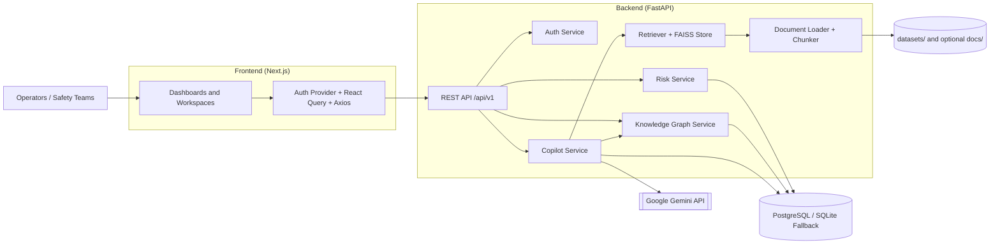
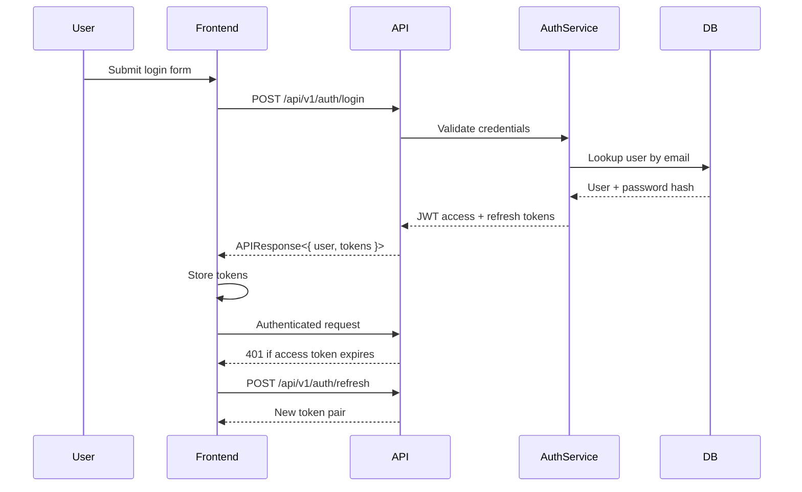

# Sentinel AI

<div align="center">
  <h3>Industrial safety intelligence platform for monitoring, compound risk analysis, explainable reasoning, and grounded AI copiloting.</h3>
  <p>
    <a href="#project-overview">Overview</a> |
    <a href="#features">Features</a> |
    <a href="#architecture">Architecture</a> |
    <a href="#api-documentation">API Docs</a> |
    <a href="#project-preview">Preview</a> |
    <a href="#contact">Contact</a>
  </p>
  <p>
    
    
    
    
    
    
    
    
  </p>
</div>

> This README is derived from the repository source code and committed project structure. When the repository does not provide enough evidence, the document says so explicitly instead of guessing.

---

## Table of Contents

- [Project Overview](#project-overview)
- [Problem Statement](#problem-statement)
- [Solution](#solution)
- [Highlights](#highlights)
- [Features](#features)
- [Tech Stack](#tech-stack)
- [Architecture](#architecture)
- [Project Structure](#project-structure)
- [Installation](#installation)
- [Environment Variables](#environment-variables)
- [Running the Project](#running-the-project)
- [API Documentation](#api-documentation)
- [Database Design](#database-design)
- [Authentication Flow](#authentication-flow)
- [AI Workflow](#ai-workflow)
- [Deployment](#deployment)
- [Performance Optimizations](#performance-optimizations)
- [Security Features](#security-features)
- [Project Preview](#project-preview)
- [Demo Assets](#demo-assets)
- [Roadmap](#roadmap)
- [Future Improvements](#future-improvements)
- [Known Limitations](#known-limitations)
- [Contributing](#contributing)
- [License](#license)
- [Acknowledgements](#acknowledgements)
- [Contact](#contact)

---

## Project Overview

Sentinel AI is a full-stack industrial safety platform that brings operational monitoring, incident context, and AI-assisted guidance into one application.

From the source code, the project includes:

- A **Next.js frontend** with protected routes, role-aware navigation, dashboards, analytics, incident views, permit workflows, maintenance views, notifications, and an AI copilot workspace.
- A **FastAPI backend** exposing **82 REST endpoints** under `/api/v1`.
- A **domain-rich data model** covering plants, zones, equipment, sensors, readings, workers, permits, maintenance, incidents, risk events, recommendations, notifications, compliance reports, documents, and chat history.
- An **AI stack** composed of a compound risk engine, explainability engine, historical similarity engine, knowledge graph analysis, FAISS-backed retrieval, SentenceTransformers embeddings, and a Gemini-powered copilot with citations.

The project appears designed for industrial operations teams who need to monitor plant state, reason about compound hazards, and ask grounded questions against both live context and indexed knowledge.

---

## Problem Statement

Industrial safety decisions rarely depend on a single signal.

In this codebase, the system models:

- Plant topology
- Zone-level risk context
- Equipment health
- Sensor readings
- Worker presence
- Permit-to-work state
- Maintenance status
- Historical incidents
- Recommendations and notifications

That structure suggests the core problem Sentinel AI addresses is **context fragmentation**: safety teams need one place to connect live operations, historical evidence, and recommended actions instead of switching between disconnected tools or static reports.

---

## Solution

Sentinel AI solves this by combining:

- A **role-aware operations UI** for monitoring plants, workers, incidents, permits, maintenance, notifications, and compliance
- A **FastAPI backend** that normalizes APIs and domain workflows
- A **compound risk engine** that merges live and contextual signals into explainable risk outcomes
- A **knowledge graph** for relationship-aware reasoning across operational entities
- A **retrieval-augmented copilot** that grounds AI responses in indexed documents, dataset-derived content, live risk context, and applicable regulations

The result is a system that does more than visualize data: it helps teams interpret risk, understand why it matters, and act with traceable evidence.

---

## Highlights

| Area | Verified from source |
|---|---|
| Full-stack product | Next.js 15 frontend paired with a standalone FastAPI backend |
| API surface | 82 endpoints across 19 route groups under `/api/v1` |
| Domain depth | 18 core entities covering plants, equipment, sensors, workers, permits, incidents, compliance, and chat history |
| AI pipeline | risk scoring, explainability, historical similarity, FAISS retrieval, and Gemini generation |
| Knowledge graph | NetworkX-based operational graph with topology, incident, permit, maintenance, and recommendation relationships |
| Operator workflows | dashboards, plant map, risk center, incident center, maintenance, permits, compliance, analytics, and AI copilot |

<p align="right"><a href="#sentinel-ai">Back to top</a></p>

---

## Features

### Core Platform

- ✅ Protected Next.js application with login and session bootstrap
- ✅ Role-aware navigation for `admin`, `plant_manager`, `safety_officer`, `maintenance`, and `viewer`
- ✅ FastAPI backend with standardized `APIResponse<T>` wrappers
- ✅ OpenAPI docs exposed at `/docs`, `/redoc`, and `/openapi.json`

### Operational Modules

- ✅ Dashboard summary with live risks, alerts, incidents, and recommendation summaries
- ✅ Plant and zone management APIs
- ✅ Equipment management and equipment health views
- ✅ Sensor and sensor-reading APIs
- ✅ Worker management plus worker-location tracking
- ✅ Permit-to-work APIs with conflict analysis
- ✅ Maintenance APIs with overdue tracking
- ✅ Incident APIs with AI-oriented incident report generation
- ✅ Notifications and unread notification endpoints
- ✅ Compliance report generation and listing
- ✅ Simulation scenario endpoints

### Intelligence and AI

- ✅ Compound risk scoring with severity, confidence, evidence, and recommendations
- ✅ Rule engine driven by `backend/app/risk_engine/rules.json`
- ✅ Historical similarity against incidents and Tennessee Eastman-style sensor patterns
- ✅ Explainability report generation
- ✅ Knowledge graph overview, node detail, neighbor expansion, path tracing, and impact analysis
- ✅ FAISS-backed vector retrieval with SentenceTransformers embeddings
- ✅ Document ingestion for `csv`, `xlsx`, `pdf`, `docx`, `json`, `dat`, `txt`, `md`, `ini`, and `.f`
- ✅ Gemini-powered copilot with:
  - citations
  - retrieved documents
  - conversation history
  - applicable regulation extraction
  - offline fallback behavior when the Gemini API is unavailable

### Frontend Experience

- ✅ React Query-based data fetching
- ✅ Axios interceptor flow with:
  - bearer token injection
  - token refresh
  - retry for safe `GET` requests on transient failures
- ✅ Dedicated UI workspaces for:
  - Dashboard
  - Plant Overview
  - Plant Map
  - Risk Center
  - Incident Center
  - Maintenance
  - Workers
  - Equipment
  - Permits
  - Compliance
  - Analytics
  - AI Copilot
  - Notifications
  - Settings

---

## Tech Stack

| Category | Technologies / Evidence |
|---|---|
| Frontend | Next.js 15, React 19, TypeScript, Tailwind CSS, React Query, Axios, Framer Motion, Recharts, Leaflet, lucide-react, zod, react-hook-form |
| Backend | FastAPI, Uvicorn, SQLAlchemy 2, Pydantic Settings, Alembic, async sessions, custom service/repository architecture |
| Database | PostgreSQL via `asyncpg`, SQLite fallback via `aiosqlite` |
| AI / ML | SentenceTransformers, FAISS, NumPy, NetworkX, Google Gemini, custom risk, similarity, explainability, and RAG layers |
| Authentication | JWT access/refresh tokens, bcrypt password hashing, FastAPI HTTP bearer auth |
| APIs | REST APIs under `/api/v1`, OpenAPI/Swagger docs, Gemini HTTP API via `httpx` |
| DevOps | Alembic migrations, pydantic-based configuration, dataset loading scripts, backend tests |
| Cloud | Google Gemini API is integrated; no cloud deployment platform is explicitly versioned in the committed repository |
| Deployment | Separate frontend/backend deployment is implied by API base URL configuration and CORS settings; no committed Docker, Render, or Vercel deployment manifests were found |

---

## Architecture



---

## Project Structure

```text
Sentinel---AI/
├── .agents/
│   └── skills/
├── backend/
│   ├── alembic/
│   │   ├── env.py
│   │   └── versions/
│   ├── app/
│   │   ├── ai/
│   │   ├── api/
│   │   │   ├── deps.py
│   │   │   ├── router.py
│   │   │   └── routes/
│   │   ├── core/
│   │   ├── database/
│   │   ├── knowledge_graph/
│   │   ├── middleware/
│   │   ├── models/
│   │   ├── rag/
│   │   ├── repositories/
│   │   ├── risk_engine/
│   │   ├── schemas/
│   │   ├── services/
│   │   ├── tests/
│   │   └── vector_store/
│   └── requirements.txt
├── datasets/
│   ├── TEdata/
│   ├── ai4i/
│   ├── generated/
│   └── osha/
├── frontend/
│   ├── package.json
│   ├── next.config.ts
│   ├── tailwind.config.ts
│   ├── tsconfig.json
│   └── src/
│       ├── app/
│       ├── components/
│       ├── features/
│       ├── hooks/
│       ├── lib/
│       ├── providers/
│       ├── services/
│       ├── store/
│       ├── styles/
│       ├── types/
│       └── utils/
└── scripts/
    ├── load_ai4i.py
    ├── load_osha.py
    ├── load_tennessee.py
    ├── seed_generated_data.py
    └── validate_db_layer.py
```

---

## Installation

> The repository does **not** include committed Dockerfiles or Compose files, so installation is based on the Python and Node project structure present in source.

### Prerequisites

- Python 3.10+ compatible environment
- Node.js and npm
- PostgreSQL if you do **not** want to use the SQLite fallback
- Git

### 1. Clone the Repository

```bash
git clone https://github.com/Shubhankar0126/Sentinel---AI.git
cd Sentinel---AI
```

### 2. Backend Setup

```bash
cd backend
python -m venv .venv
```

Activate the virtual environment:

**Windows (PowerShell)**

```powershell
.venv\Scripts\Activate.ps1
```

**macOS / Linux**

```bash
source .venv/bin/activate
```

Install backend dependencies:

```bash
pip install -r requirements.txt
```

### 3. Frontend Setup

In a second terminal:

```bash
cd frontend
npm install
```

### 4. Configure Environment Variables

Create a root `.env` file for the backend settings consumed by `backend/app/core/config.py`.

At minimum:

- Set `JWT_SECRET`
- Decide whether to use `DATABASE_URL` or the SQLite fallback
- Add `GEMINI_API_KEY` if you want live Gemini responses instead of the offline fallback path

For the frontend, set:

```bash
NEXT_PUBLIC_API_BASE_URL=http://127.0.0.1:8000/api/v1
```

### 5. Database Initialization

Run Alembic migrations from the `backend/` directory:

```bash
alembic upgrade head
```

If you are using SQLite fallback in local development, make sure:

- `USE_SQLITE_FALLBACK=true`
- `ENVIRONMENT=development`

### 6. Optional Data Loading

The repository includes ingestion utilities under `scripts/`:

```bash
python scripts/load_ai4i.py
python scripts/load_osha.py
python scripts/load_tennessee.py
python scripts/seed_generated_data.py
```

---

## Environment Variables

The backend defines defaults in [`backend/app/core/config.py`](backend/app/core/config.py). The tables below list the environment variables used by the codebase.

> **Required** here means required for a secure or production-like setup. Some values have code defaults and are optional for local development.

### Application and API

| Variable | Required | Description |
|---|---|---|
| `APP_NAME` | No | FastAPI application title shown in docs and metadata |
| `APP_VERSION` | No | Backend version string |
| `ENVIRONMENT` | Recommended | Runtime environment such as `development` or `production` |
| `DEBUG` | No | Enables SQLAlchemy echo and FastAPI debug behavior |
| `API_PREFIX` | No | API prefix; defaults to `/api/v1` |
| `LOG_LEVEL` | No | Logging verbosity |
| `CORS_ORIGINS` | Recommended | Allowed frontend origins for cross-origin requests |
| `REQUEST_ID_HEADER` | No | Header name used for request tracing |
| `PAGE_SIZE_DEFAULT` | No | Default pagination size |
| `PAGE_SIZE_MAX` | No | Maximum pagination size |

### Database

| Variable | Required | Description |
|---|---|---|
| `DATABASE_URL` | Conditional | Primary async database URL; required in production when SQLite fallback is disabled |
| `SQLITE_FALLBACK_URL` | No | Local SQLite fallback connection string |
| `USE_SQLITE_FALLBACK` | No | Allows SQLite fallback outside production |
| `AUTO_CREATE_SCHEMA` | No | If `true`, creates schema on startup via `initialize_schema()` |

### Authentication and Access

| Variable | Required | Description |
|---|---|---|
| `JWT_SECRET` | **Yes** | Secret used to sign JWT access and refresh tokens |
| `JWT_ALGORITHM` | No | JWT signing algorithm; defaults to `HS256` |
| `ACCESS_TOKEN_EXPIRE_MINUTES` | No | Access token lifetime in minutes |
| `REFRESH_TOKEN_EXPIRE_DAYS` | No | Refresh token lifetime in days |
| `DEFAULT_ADMIN_NAME` | No | Default admin seed/display value |
| `DEFAULT_ADMIN_EMAIL` | No | Default admin seed/display value |
| `DEFAULT_ADMIN_PASSWORD` | No | Default admin seed/display value |

### Dataset, Risk, and Graph Settings

| Variable | Required | Description |
|---|---|---|
| `DATASET_ROOT` | Recommended | Root folder for local datasets |
| `ENABLE_DATASET_HEALTH_CHECKS` | No | Enables dataset health-related behavior |
| `TE_SAMPLE_MODE` | No | Enables Tennessee Eastman sampling behavior |
| `TE_SAMPLE_FRACTION` | No | Fraction of TE rows sampled |
| `TE_ROW_CHUNK_SIZE` | No | Chunk size used when iterating TE rows |
| `TE_INSERT_BATCH_SIZE` | No | Batch size used during TE ingestion |
| `RISK_RULES_PATH` | Recommended | Path to `rules.json` for the rule engine |
| `GRAPH_DEFAULT_DEPTH` | No | Default graph traversal depth |
| `GRAPH_SAMPLE_LIMIT` | No | Sample size returned by graph overview/detail responses |
| `SIMILARITY_MATCH_LIMIT` | No | Max historical similarity matches returned |

### RAG and Gemini

| Variable | Required | Description |
|---|---|---|
| `RAG_INDEX_DIR` | Recommended | Directory for persisted FAISS artifacts and metadata |
| `EMBEDDING_MODEL_NAME` | No | SentenceTransformers embedding model name |
| `RAG_CHUNK_SIZE` | No | Chunk size for document splitting |
| `RAG_CHUNK_OVERLAP` | No | Overlap between adjacent chunks |
| `RAG_TOP_K` | No | Default number of retrieval results |
| `RAG_STRUCTURED_ROWS_PER_SECTION` | No | Number of CSV/XLSX rows grouped into one section |
| `RAG_TE_PREVIEW_ROWS` | No | Number of TE rows summarized into the RAG context |
| `GEMINI_API_KEY` | Conditional | Required only for live Gemini calls; absent key triggers offline fallback |
| `GEMINI_MODEL` | No | Gemini model name |
| `GEMINI_REQUEST_TIMEOUT_SECONDS` | No | Request timeout for Gemini HTTP calls |

### Frontend

| Variable | Required | Description |
|---|---|---|
| `NEXT_PUBLIC_API_BASE_URL` | Recommended | Frontend base URL for calling the backend API |

---

## Running the Project

### Frontend

From `frontend/`:

```bash
npm run dev
```

The committed script starts Next.js on:

- `http://127.0.0.1:3001`

### Backend

From `backend/`:

```bash
uvicorn app.main:app --reload --host 127.0.0.1 --port 8000
```

Useful backend URLs:

- Swagger UI: `http://127.0.0.1:8000/docs`
- ReDoc: `http://127.0.0.1:8000/redoc`
- OpenAPI JSON: `http://127.0.0.1:8000/openapi.json`

### Docker

Docker commands are **not available from this repository alone**.

No committed files were found for:

- `Dockerfile`
- `docker-compose.yml`
- `docker-compose.yaml`
- `render.yaml`
- `Procfile`
- `vercel.json`

### Development Mode

Run backend and frontend in separate terminals:

```bash
# terminal 1
cd backend
uvicorn app.main:app --reload --host 127.0.0.1 --port 8000

# terminal 2
cd frontend
npm run dev
```

### Production Mode

The repository includes frontend production scripts:

```bash
cd frontend
npm run build
npm run start
```

For the backend, the committed project exposes the ASGI app at `app.main:app`, but no production process-manager configuration is committed. A deployment setup should therefore define its own production entrypoint and infrastructure configuration.

---

## API Documentation

All backend endpoints are mounted under:

```text
/api/v1
```

Every response is wrapped by `APIResponse[T]`, which includes:

- `success`
- `message`
- `data`
- `pagination`
- `errors`
- `timestamp`

> In the tables below, **Request Body** and **Response** refer to the Pydantic schema names used directly in the route signatures.

### Endpoint Inventory

<details>
<summary><strong>Actions (4 endpoints)</strong></summary>

| Method | Endpoint | Description | Auth | Request Body | Response |
|---|---|---|---|---|---|
| `GET` | `/api/v1/actions` | List actions | JWT | `None` | `APIResponse[list[RecommendationRead]]` |
| `GET` | `/api/v1/actions/pending` | List pending recommendations | JWT | `None` | `APIResponse[list[RecommendationRead]]` |
| `POST` | `/api/v1/actions` | Create action | JWT + role | `RecommendationCreate` | `APIResponse[RecommendationRead]` |
| `PUT` | `/api/v1/actions/{action_id}` | Update action | JWT + role | `RecommendationUpdate` | `APIResponse[RecommendationRead]` |

</details>

<details>
<summary><strong>Analytics (1 endpoints)</strong></summary>

| Method | Endpoint | Description | Auth | Request Body | Response |
|---|---|---|---|---|---|
| `GET` | `/api/v1/analytics/overview` | Get analytics overview | JWT | `None` | `APIResponse[AnalyticsOverview]` |

</details>

<details>
<summary><strong>Auth (4 endpoints)</strong></summary>

| Method | Endpoint | Description | Auth | Request Body | Response |
|---|---|---|---|---|---|
| `POST` | `/api/v1/auth/register` | Register a user account | No | `RegisterRequest` | `APIResponse[dict]` |
| `POST` | `/api/v1/auth/login` | Authenticate a user | No | `LoginRequest` | `APIResponse[dict]` |
| `POST` | `/api/v1/auth/refresh` | Refresh JWT tokens | No | `RefreshTokenRequest` | `APIResponse[dict]` |
| `GET` | `/api/v1/auth/me` | Get current authenticated user | JWT | `None` | `APIResponse[UserRead]` |

</details>

<details>
<summary><strong>Compliance (2 endpoints)</strong></summary>

| Method | Endpoint | Description | Auth | Request Body | Response |
|---|---|---|---|---|---|
| `GET` | `/api/v1/compliance` | List reports | JWT | `None` | `APIResponse[list[ComplianceReportRead]]` |
| `POST` | `/api/v1/compliance/generate` | Generate compliance report | JWT | `ComplianceReportRequest` | `APIResponse[ComplianceReportRead]` |

</details>

<details>
<summary><strong>Copilot (3 endpoints)</strong></summary>

| Method | Endpoint | Description | Auth | Request Body | Response |
|---|---|---|---|---|---|
| `POST` | `/api/v1/copilot/chat` | Run grounded AI copilot chat | JWT | `CopilotChatRequest` | `APIResponse[CopilotChatResponse]` |
| `GET` | `/api/v1/copilot/history` | List copilot chat history | JWT | `None` | `APIResponse[list[ChatHistoryRead]]` |
| `DELETE` | `/api/v1/copilot/history` | Delete copilot chat history | JWT | `None` | `APIResponse[CopilotHistoryDeleteResponse]` |

</details>

<details>
<summary><strong>Dashboard (1 endpoints)</strong></summary>

| Method | Endpoint | Description | Auth | Request Body | Response |
|---|---|---|---|---|---|
| `GET` | `/api/v1/dashboard` | Get dashboard | JWT | `None` | `APIResponse[DashboardSummary]` |

</details>

<details>
<summary><strong>Equipment (6 endpoints)</strong></summary>

| Method | Endpoint | Description | Auth | Request Body | Response |
|---|---|---|---|---|---|
| `GET` | `/api/v1/equipment` | List equipment | JWT | `None` | `APIResponse[list[EquipmentRead]]` |
| `GET` | `/api/v1/equipment/{equipment_id}` | Get equipment | JWT | `None` | `APIResponse[EquipmentRead]` |
| `GET` | `/api/v1/equipment/{equipment_id}/health` | Get equipment health summary | JWT | `None` | `APIResponse[dict]` |
| `POST` | `/api/v1/equipment` | Create equipment | JWT + role | `EquipmentCreate` | `APIResponse[EquipmentRead]` |
| `PUT` | `/api/v1/equipment/{equipment_id}` | Update equipment | JWT + role | `EquipmentUpdate` | `APIResponse[EquipmentRead]` |
| `DELETE` | `/api/v1/equipment/{equipment_id}` | Delete equipment | JWT + role | `None` | `APIResponse[dict]` |

</details>

<details>
<summary><strong>Graph (4 endpoints)</strong></summary>

| Method | Endpoint | Description | Auth | Request Body | Response |
|---|---|---|---|---|---|
| `GET` | `/api/v1/graph` | Get knowledge graph overview | JWT | `None` | `APIResponse[KnowledgeGraphOverview]` |
| `GET` | `/api/v1/graph/node` | Get graph node detail | JWT | `None` | `APIResponse[GraphNodeDetail]` |
| `GET` | `/api/v1/graph/neighbors` | Get graph neighbors | JWT | `None` | `APIResponse[GraphNeighborhoodResult]` |
| `GET` | `/api/v1/graph/path` | Find shortest relationship path | JWT | `None` | `APIResponse[GraphPathResult]` |

</details>

<details>
<summary><strong>Health (2 endpoints)</strong></summary>

| Method | Endpoint | Description | Auth | Request Body | Response |
|---|---|---|---|---|---|
| `GET` | `/api/v1/health` | Backend health check | No | `None` | `APIResponse[dict]` |
| `GET` | `/api/v1/version` | Backend version info | No | `None` | `APIResponse[dict]` |

</details>

<details>
<summary><strong>Incidents (6 endpoints)</strong></summary>

| Method | Endpoint | Description | Auth | Request Body | Response |
|---|---|---|---|---|---|
| `GET` | `/api/v1/incidents` | List incidents | JWT | `None` | `APIResponse[list[IncidentRead]]` |
| `GET` | `/api/v1/incidents/{incident_id}` | Get incident | JWT | `None` | `APIResponse[IncidentRead]` |
| `GET` | `/api/v1/incidents/{incident_id}/report` | Generate incident report | JWT | `None` | `APIResponse[dict]` |
| `POST` | `/api/v1/incidents` | Create incident | JWT + role | `IncidentCreate` | `APIResponse[IncidentRead]` |
| `PUT` | `/api/v1/incidents/{incident_id}` | Update incident | JWT + role | `IncidentUpdate` | `APIResponse[IncidentRead]` |
| `DELETE` | `/api/v1/incidents/{incident_id}` | Delete incident | JWT + role | `None` | `APIResponse[dict]` |

</details>

<details>
<summary><strong>Maintenance (6 endpoints)</strong></summary>

| Method | Endpoint | Description | Auth | Request Body | Response |
|---|---|---|---|---|---|
| `GET` | `/api/v1/maintenance` | List maintenance | JWT | `None` | `APIResponse[list[MaintenanceRead]]` |
| `GET` | `/api/v1/maintenance/overdue` | Overdue maintenance | JWT | `None` | `APIResponse[list[MaintenanceRead]]` |
| `GET` | `/api/v1/maintenance/{maintenance_id}` | Get maintenance | JWT | `None` | `APIResponse[MaintenanceRead]` |
| `POST` | `/api/v1/maintenance` | Create maintenance | JWT + role | `MaintenanceCreate` | `APIResponse[MaintenanceRead]` |
| `PUT` | `/api/v1/maintenance/{maintenance_id}` | Update maintenance | JWT + role | `MaintenanceUpdate` | `APIResponse[MaintenanceRead]` |
| `DELETE` | `/api/v1/maintenance/{maintenance_id}` | Delete maintenance | JWT + role | `None` | `APIResponse[dict]` |

</details>

<details>
<summary><strong>Notifications (5 endpoints)</strong></summary>

| Method | Endpoint | Description | Auth | Request Body | Response |
|---|---|---|---|---|---|
| `GET` | `/api/v1/notifications` | List notifications | JWT | `None` | `APIResponse[list[NotificationRead]]` |
| `GET` | `/api/v1/notifications/unread` | List unread notifications | JWT | `None` | `APIResponse[list[NotificationRead]]` |
| `POST` | `/api/v1/notifications` | Create notification | JWT + role | `NotificationCreate` | `APIResponse[NotificationRead]` |
| `PUT` | `/api/v1/notifications/{notification_id}` | Update notification | JWT | `NotificationUpdate` | `APIResponse[NotificationRead]` |
| `DELETE` | `/api/v1/notifications/{notification_id}` | Delete notification | JWT | `None` | `APIResponse[dict]` |

</details>

<details>
<summary><strong>Permits (6 endpoints)</strong></summary>

| Method | Endpoint | Description | Auth | Request Body | Response |
|---|---|---|---|---|---|
| `GET` | `/api/v1/permits` | List permits | JWT | `None` | `APIResponse[list[PermitRead]]` |
| `GET` | `/api/v1/permits/{permit_id}` | Get permit | JWT | `None` | `APIResponse[PermitRead]` |
| `GET` | `/api/v1/permits/{permit_id}/conflicts` | Permit conflicts | JWT | `None` | `APIResponse[list[PermitRead]]` |
| `POST` | `/api/v1/permits` | Create permit | JWT + role | `PermitCreate` | `APIResponse[PermitRead]` |
| `PUT` | `/api/v1/permits/{permit_id}` | Update permit | JWT + role | `PermitUpdate` | `APIResponse[PermitRead]` |
| `DELETE` | `/api/v1/permits/{permit_id}` | Delete permit | JWT + role | `None` | `APIResponse[dict]` |

</details>

<details>
<summary><strong>Plants (5 endpoints)</strong></summary>

| Method | Endpoint | Description | Auth | Request Body | Response |
|---|---|---|---|---|---|
| `GET` | `/api/v1/plants` | List plants | JWT | `None` | `APIResponse[list[PlantRead]]` |
| `GET` | `/api/v1/plants/{plant_id}` | Get plant | JWT | `None` | `APIResponse[PlantRead]` |
| `POST` | `/api/v1/plants` | Create plant | JWT + role | `PlantCreate` | `APIResponse[PlantRead]` |
| `PUT` | `/api/v1/plants/{plant_id}` | Update plant | JWT + role | `PlantUpdate` | `APIResponse[PlantRead]` |
| `DELETE` | `/api/v1/plants/{plant_id}` | Delete plant | JWT + role | `None` | `APIResponse[dict]` |

</details>

<details>
<summary><strong>Risk (3 endpoints)</strong></summary>

| Method | Endpoint | Description | Auth | Request Body | Response |
|---|---|---|---|---|---|
| `POST` | `/api/v1/risk/analyze` | Analyze risk | JWT + role | `RiskAnalysisRequest` | `APIResponse[RiskAnalysisResult]` |
| `GET` | `/api/v1/risk/history` | List historical risk events | JWT | `None` | `APIResponse[list[RiskEventRead]]` |
| `GET` | `/api/v1/risk/live` | List live risk events | JWT | `None` | `APIResponse[list[RiskEventRead]]` |

</details>

<details>
<summary><strong>Sensors (8 endpoints)</strong></summary>

| Method | Endpoint | Description | Auth | Request Body | Response |
|---|---|---|---|---|---|
| `GET` | `/api/v1/sensors` | List sensors | JWT | `None` | `APIResponse[list[SensorRead]]` |
| `GET` | `/api/v1/sensors/{sensor_id}` | Get sensor | JWT | `None` | `APIResponse[SensorRead]` |
| `POST` | `/api/v1/sensors` | Create sensor | JWT + role | `SensorCreate` | `APIResponse[SensorRead]` |
| `PUT` | `/api/v1/sensors/{sensor_id}` | Update sensor | JWT + role | `SensorUpdate` | `APIResponse[SensorRead]` |
| `DELETE` | `/api/v1/sensors/{sensor_id}` | Delete sensor | JWT + role | `None` | `APIResponse[dict]` |
| `GET` | `/api/v1/sensors/{sensor_id}/readings` | Sensor readings | JWT | `None` | `APIResponse[list[SensorReadingRead]]` |
| `POST` | `/api/v1/sensors/readings` | Create sensor reading | JWT + role | `SensorReadingCreate` | `APIResponse[SensorReadingRead]` |
| `PUT` | `/api/v1/sensors/readings/{reading_id}` | Update sensor reading | JWT + role | `SensorReadingUpdate` | `APIResponse[SensorReadingRead]` |

</details>

<details>
<summary><strong>Simulation (2 endpoints)</strong></summary>

| Method | Endpoint | Description | Auth | Request Body | Response |
|---|---|---|---|---|---|
| `GET` | `/api/v1/simulation/scenarios` | List supported simulation scenarios | JWT | `None` | `APIResponse[list[str]]` |
| `POST` | `/api/v1/simulation/start` | Start a simulation scenario | JWT | `SimulationRequest` | `APIResponse[SimulationResponse]` |

</details>

<details>
<summary><strong>Workers (8 endpoints)</strong></summary>

| Method | Endpoint | Description | Auth | Request Body | Response |
|---|---|---|---|---|---|
| `GET` | `/api/v1/workers` | List workers | JWT | `None` | `APIResponse[list[WorkerRead]]` |
| `GET` | `/api/v1/workers/{worker_id}` | Get worker | JWT | `None` | `APIResponse[WorkerRead]` |
| `GET` | `/api/v1/workers/{worker_id}/safety` | Get worker safety summary | JWT | `None` | `APIResponse[dict]` |
| `POST` | `/api/v1/workers` | Create worker | JWT + role | `WorkerCreate` | `APIResponse[WorkerRead]` |
| `PUT` | `/api/v1/workers/{worker_id}` | Update worker | JWT + role | `WorkerUpdate` | `APIResponse[WorkerRead]` |
| `DELETE` | `/api/v1/workers/{worker_id}` | Delete worker | JWT + role | `None` | `APIResponse[dict]` |
| `POST` | `/api/v1/workers/locations` | Create worker location | JWT + role | `WorkerLocationCreate` | `APIResponse[WorkerLocationRead]` |
| `PUT` | `/api/v1/workers/locations/{location_id}` | Update worker location | JWT + role | `WorkerLocationUpdate` | `APIResponse[WorkerLocationRead]` |

</details>

<details>
<summary><strong>Zones (6 endpoints)</strong></summary>

| Method | Endpoint | Description | Auth | Request Body | Response |
|---|---|---|---|---|---|
| `GET` | `/api/v1/zones` | List zones | JWT | `None` | `APIResponse[list[ZoneRead]]` |
| `GET` | `/api/v1/zones/{zone_id}` | Get zone | JWT | `None` | `APIResponse[ZoneRead]` |
| `GET` | `/api/v1/zones/{zone_id}/summary` | Get zone summary | JWT | `None` | `APIResponse[dict]` |
| `POST` | `/api/v1/zones` | Create zone | JWT + role | `ZoneCreate` | `APIResponse[ZoneRead]` |
| `PUT` | `/api/v1/zones/{zone_id}` | Update zone | JWT + role | `ZoneUpdate` | `APIResponse[ZoneRead]` |
| `DELETE` | `/api/v1/zones/{zone_id}` | Delete zone | JWT + role | `None` | `APIResponse[dict]` |

</details>

---

## Database Design

The main database model is defined in `backend/app/models/entities.py`.

### Core Models

| Model | Purpose |
|---|---|
| `User` | Authenticated platform user with role and optional plant association |
| `Plant` | Top-level industrial site |
| `Zone` | Plant sub-area with risk context |
| `Equipment` | Asset tracked within a plant or zone |
| `Sensor` | Sensor associated with a zone or piece of equipment |
| `SensorReading` | Time-stamped reading for a sensor |
| `Worker` | Worker/personnel record |
| `WorkerLocation` | Worker-to-zone time-stamped location record |
| `Permit` | Permit-to-work entity |
| `Maintenance` | Maintenance record for equipment |
| `Incident` | Operational/safety incident |

### Risk, Action, and Oversight Models

| Model | Purpose |
|---|---|
| `RiskEvent` | Stored risk-analysis result |
| `Recommendation` | Recommended action tied to risk |
| `Notification` | Alert/notification message |
| `ComplianceReport` | Generated compliance scoring/report record |
| `Document` | Stored document metadata model |
| `ChatHistory` | Saved copilot conversation history |
| `AuditLog` | Audit-related user/system record |

### Key Relationships

- `Plant -> Zone`
- `Plant -> Equipment`
- `Plant -> ComplianceReport`
- `Plant -> Document`
- `Zone -> Equipment`
- `Zone -> Sensor`
- `Zone -> WorkerLocation`
- `Zone -> Permit`
- `Zone -> Incident`
- `Zone -> RiskEvent`
- `Equipment -> Sensor`
- `Equipment -> Maintenance`
- `Equipment -> Incident`
- `Equipment -> Permit`
- `Worker -> WorkerLocation`
- `Worker -> Incident`
- `RiskEvent -> Recommendation`
- `User -> Notification`
- `User -> AuditLog`
- `User -> ChatHistory`

---

## Authentication Flow

Authentication is implemented in:

- `backend/app/services/auth.py`
- `backend/app/core/security.py`
- `backend/app/api/deps.py`
- `frontend/src/providers/auth-provider.tsx`
- `frontend/src/services/api-client.ts`

### Flow Summary

1. The frontend submits credentials to `/api/v1/auth/login`.
2. The backend looks up the user by email and verifies the bcrypt password hash.
3. On success, the backend returns an access token and refresh token.
4. The frontend stores tokens and attaches the access token to future requests.
5. If the backend returns `401`, the Axios client attempts `/api/v1/auth/refresh`.
6. If refresh fails, the frontend clears tokens and emits `sentinel:auth-expired`.

### Mermaid Sequence



---

## AI Workflow

The AI workflow is spread across:

- `backend/app/services/risk.py`
- `backend/app/risk_engine/*`
- `backend/app/knowledge_graph/*`
- `backend/app/rag/*`
- `backend/app/ai/gemini.py`
- `backend/app/services/copilot.py`

### 1. Input

- User question and optional plant context via `CopilotChatRequest`
- Risk payloads via `RiskAnalysisRequest`
- Optional conversation history and metadata filters

### 2. Processing

- The risk service enriches incoming context with:
  - equipment health
  - sensor readings
  - worker presence
  - open permits
  - maintenance records
  - historical incidents
  - weather data
- The rule engine evaluates configured rules from `rules.json`
- The compound engine calculates risk score, severity, confidence, and evidence
- The explainability engine prepares structured reasoning output

### 3. Embeddings

- `SentenceTransformerEmbeddingService` is used for text embeddings
- `HashingEmbeddingService` exists as an offline fallback
- The embedding service is cached with `@lru_cache(maxsize=1)`

### 4. Retriever

- `ModularDocumentLoader` ingests:
  - CSV
  - XLSX
  - PDF
  - DOCX
  - JSON
  - DAT
  - TXT / MD / INI / `.f`
- `TextChunker` splits document sections into chunks
- `FaissVectorStore` persists the index, metadata, and embeddings under `backend/.vector_store`
- `ContextRetriever` checks a file manifest and only rebuilds the index when the source inventory changes

### 5. LLM

- `CopilotService` combines:
  - retrieved chunks
  - live risks
  - related incidents
  - pending recommendations
  - knowledge graph summary
- `GeminiClient` builds a structured prompt and calls the Gemini API through `httpx`
- If Gemini is unavailable or unconfigured, the backend returns an offline fallback response

### 6. Output

The copilot returns:

- `summary`
- `current_situation`
- `evidence`
- `applicable_regulations`
- `recommendations`
- `citations`
- `confidence`
- `provider`
- `retrieved_documents`
- `saved_chat`

---

## Deployment

### What the Repository Clearly Shows

- The frontend calls a separately configured backend through `NEXT_PUBLIC_API_BASE_URL`.
- The backend exposes a standalone FastAPI app.
- CORS is configured for local origins and one Vercel domain in `backend/app/core/config.py`.
- The backend can run with PostgreSQL or SQLite fallback.
- Gemini is called as an external HTTP API.

### What the Repository Does **Not** Show

No committed files were found for:

- Docker
- Docker Compose
- Render deployment descriptors
- Vercel deployment config
- Reverse proxy config
- CI/CD workflows

### Practical Deployment Reading

The code strongly suggests a split deployment model:

- **Frontend** hosted separately and pointed at the backend API
- **Backend** deployed as an ASGI service
- **Database** provided externally or via local SQLite fallback
- **AI service** consumed from Google Gemini over HTTP

Because infrastructure-as-code is not committed, exact production deployment steps cannot be stated with certainty from the repository alone.

---

## Performance Optimizations

Source-backed optimizations already present in the codebase include:

- **Async SQLAlchemy sessions** via `create_async_engine` and `async_sessionmaker`
- **Connection health checks** with `pool_pre_ping` for non-SQLite databases
- **React Query caching** on the frontend
- **Axios request retry logic** for safe `GET` requests on transient failures
- **Single refresh promise coordination** to avoid duplicate token refresh calls
- **Persistent FAISS index artifacts** instead of recomputing embeddings every query
- **Manifest-based RAG index reuse** to avoid unnecessary rebuilds
- **Cached embedding service** through `@lru_cache`
- **Read-only XLSX ingestion** with `openpyxl.load_workbook(..., read_only=True, data_only=True)`
- **Chunked Tennessee Eastman row iteration** through ingestion utilities

---

## Security Features

Security-related behavior present in source includes:

- JWT access and refresh tokens
- bcrypt password hashing and verification
- `HTTPBearer` token extraction for protected routes
- role-based authorization through `require_roles(...)`
- standardized validation and exception handling in FastAPI
- centralized configuration for CORS origins
- Gemini prompt guardrails that explicitly forbid inventing new numerical risk scores
- token invalidation behavior on refresh failure in the frontend

---

## Project Preview

The committed repository currently includes one visual asset and no versioned UI screenshots. This section keeps the README presentation-ready without pretending assets exist when they do not.

| View / Asset | Repository status | Suggested documentation asset |
|---|---|---|
| Dashboard overview | Not committed | `docs/screenshots/dashboard-overview.png` |
| Risk center | Not committed | `docs/screenshots/risk-center.png` |
| AI copilot | Not committed | `docs/screenshots/ai-copilot.png` |
| Plant map | Not committed | `docs/screenshots/plant-map.png` |
| Compliance workspace | Not committed | `docs/screenshots/compliance-report.png` |

<p align="right"><a href="#sentinel-ai">Back to top</a></p>

---

## Demo Assets

No live demo link, demo GIF, presentation deck, or architecture PDF is committed in the repository snapshot analyzed for this README.

Recommended additions for a stronger portfolio or hackathon presentation:

| Asset | Verified current state | Suggested addition |
|---|---|---|
| Live demo URL | Not found in committed repo | Add deployed frontend URL once publicly hosted |
| Demo GIF | Not found in committed repo | `docs/demo/sentinel-demo.gif` |
| Product walkthrough video | Not found in committed repo | Add YouTube or Loom link |
| Pitch deck | Not found in committed repo | `docs/presentation/Sentinel-AI-presentation.pdf` |
| Architecture one-pager | Not found in committed repo | `docs/architecture/system-architecture.pdf` |

<p align="right"><a href="#sentinel-ai">Back to top</a></p>

---

## Screenshots

### Available Asset

- The committed repository tree includes a logo asset at `frontend/public/logo.png`.

### Missing UI Screenshots

No committed UI screenshots were found in the repository during analysis. The preview table above lists the highest-value images to add first.

<p align="right"><a href="#sentinel-ai">Back to top</a></p>

---

## Roadmap

Based on the current repository state, the highest-impact next steps are:

| Track | Recommended next move | Why it matters |
|---|---|---|
| Documentation polish | Add real product screenshots, a demo GIF, and public presentation links | Makes the repository stronger for recruiters, judges, and collaborators |
| Reproducible delivery | Commit Docker and deployment manifests | Improves onboarding and reduces setup friction |
| Contributor experience | Track a maintained `.env.example` and add CI checks | Makes the project easier to run and safer to change |
| Observability | Add metrics around API latency, retrieval latency, and Gemini failures | Helps production hardening and troubleshooting |
| AI scalability | Move expensive indexing or ingestion paths into background jobs if latency grows | Keeps user-facing workflows responsive at larger scale |

<p align="right"><a href="#sentinel-ai">Back to top</a></p>

---

## Future Improvements

- Edge AI deployment for on-premise industrial environments
- Real-time IoT sensor integration using MQTT/Kafka
- Predictive maintenance using time-series forecasting
- Computer Vision integration for PPE compliance and hazard detection
- Digital Twin visualization for industrial plants
- Multi-plant monitoring and centralized command center
- Mobile application for field engineers and safety officers
- Voice-enabled AI Copilot for hands-free industrial operations
- Advanced analytics dashboards with customizable KPIs
- Kubernetes-based deployment for large-scale production environments

<p align="right"><a href="#sentinel-ai">Back to top</a></p>

---

## Known Limitations

- No committed Docker or deployment manifests were found
- No committed frontend UI screenshots or demo assets were found
- The repository does not explicitly pin a Python runtime version
- `.env.example` was present in the analyzed working tree earlier, but is not tracked in the committed `HEAD` tree
- Exact cloud deployment architecture cannot be reproduced with certainty from the repository alone

<p align="right"><a href="#sentinel-ai">Back to top</a></p>

---

## Contributing

Contributions are welcome.

Suggested flow:

1. Fork the repository
2. Create a focused feature branch
3. Keep changes well-scoped and documented
4. Add or update tests when behavior changes
5. Open a pull request with a clear summary, validation steps, and screenshots where relevant

If you plan a larger change, opening an issue first is a good way to align on direction.

<p align="right"><a href="#sentinel-ai">Back to top</a></p>

---

## License

This repository now includes an explicit [MIT License](LICENSE).

MIT is a strong default here because it is simple, permissive, and well-suited for portfolio projects, hackathon submissions, recruiter review, and collaborative reuse. If you want stronger copyleft or patent language later, you can replace it intentionally.

<p align="right"><a href="#sentinel-ai">Back to top</a></p>

---

## Acknowledgements

- [FastAPI](https://fastapi.tiangolo.com/)
- [Next.js](https://nextjs.org/)
- [SQLAlchemy](https://www.sqlalchemy.org/)
- [SentenceTransformers](https://www.sbert.net/)
- [FAISS](https://github.com/facebookresearch/faiss)
- [NetworkX](https://networkx.org/)
- [Google Gemini](https://ai.google.dev/)
- Tennessee Eastman-style process data included under `datasets/TEdata`
- AI4I dataset assets under `datasets/ai4i`
- OSHA dataset asset under `datasets/osha`

<p align="right"><a href="#sentinel-ai">Back to top</a></p>

---

## Contact

- GitHub: [@Shubhankar0126](https://github.com/Shubhankar0126)
- LinkedIn: `[Add LinkedIn URL]`
- Email: `[Add contact email]`
- Portfolio: `[Add portfolio URL]`

<p align="right"><a href="#sentinel-ai">Back to top</a></p>
